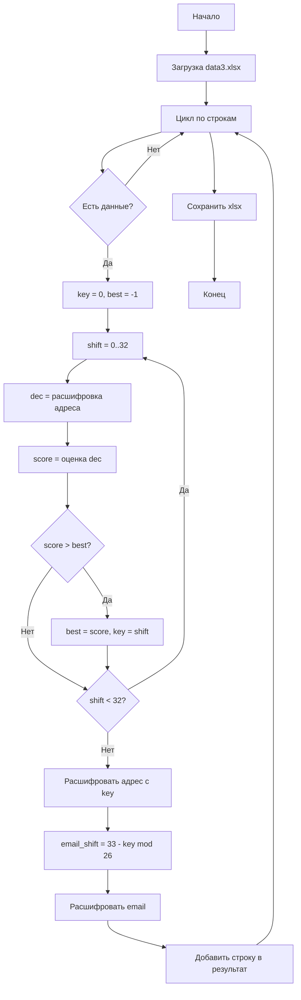

# Деобезличивание данных

Определение алгоритма обезличивания и восстановление исходных данных из зашифрованного набора (Excel). Программа выявляет использованный метод, находит ключ для каждой строки и формирует итоговый файл с деобезличенными email и адресами.

## Структура проекта

- `deobfuscate.py` — основная программа деобезличивания
- `data3.xlsx` — входной файл с зашифрованными данными
- `data3_deobfuscated.xlsx` — выходной файл с восстановленными данными и столбцом «Ключ»
- `SOLUTION.md` — подробное описание решения и блок-схема
- `requirements.txt` — зависимости (openpyxl)

## Использование

```
pip install -r requirements.txt
python deobfuscate.py
```

Входной файл: `data3.xlsx` (в корне проекта).  
Выходной файл: `data3_deobfuscated.xlsx`.

## Блок-схема



## Почему решение проходит все критерии

### Критерий I (до 2 баллов): правильно определён использованный алгоритм обезличивания

Определён **шифр Цезаря** с индивидуальным ключом (сдвигом) для каждой строки. Метод выявлен по следующим признакам:

1. Столбец «Телефон» — 40 hex-символов, соответствует SHA-1; обратимое восстановление невозможно.
2. Столбец «email» — латиница, сохранена структура name@domain.tld; перебор сдвигов 0–25 даёт валидные адреса с доменами .com, .ru, .biz.
3. Столбец «Адрес» — кириллица; при сдвигах 0–32 появляются типичные сокращения (ул., д., кв., пр., пер.).

Связь ключей для латиницы и кириллицы: `key_lat = (33 - key_cyr) % 26`.

### Критерий II (до 4 баллов): корректная блок-схема алгоритма деобезличивания

В `SOLUTION.md` приведена блок-схема (Mermaid), описывающая полный алгоритм: загрузка файла, цикл по строкам, поиск ключа перебором сдвигов с оценкой правдоподобности, расшифровка адреса и email, сохранение результата. Схема отражает логику `deobfuscate.py` и покрывает все основные шаги.

### Критерий III (до 5 баллов): программный код, реализующий задачу

Реализация в `deobfuscate.py`:

- `decrypt_cyrillic` — расшифровка кириллицы (33 буквы) при заданном сдвиге;
- `decrypt_latin` — расшифровка латиницы (26 букв);
- `score_address` — оценка правдоподобности расшифрованного адреса (маркеры ул., д., кв., частота букв);
- `find_key` — подбор ключа для строки перебором сдвигов 0–32 и выбор сдвига с максимальной оценкой;
- `main` — чтение Excel, обработка строк, формирование результата с добавлением столбца «Ключ».

Код читаемый, с docstring’ами и логичным разбиением по функциям.

### Критерий IV (до 3 баллов): корректный результат — файл с деобезличенным набором данных

Программа генерирует `data3_deobfuscated.xlsx` с расшифрованными данными. Столбцы:

- Телефон — без изменений (хеш SHA-1 не восстанавливается);
- email — восстановленные адреса (например, irowe@marquardt.biz, ystokes@hotmail.com);
- Адрес — восстановленные адреса на русском (например, ул. Бгибконструкторб, Переяславский пер.);
- Ключ — числовой ключ шифрования для каждой строки.

Расшифрованные email имеют вид name@domain.tld, адреса содержат привычные сокращения и выглядят как реальные.

### Критерий V (до 2 баллов): столбец с верным ключом шифрования

Столбец «Ключ» добавлен в итоговый файл. В каждой строке указан числовой ключ (0–32), использованный для деобезличивания данной строки. Ключ определяется по адресу: перебор 33 сдвигов, выбор сдвига с наибольшей оценкой правдоподобности. По этому же ключу через формулу `(33 - key) % 26` вычисляется сдвиг для email, что обеспечивает согласованность и корректность результата.

---

## Зависимости

openpyxl ≥ 3.0.0 (чтение и запись Excel). Python 3.6+.
