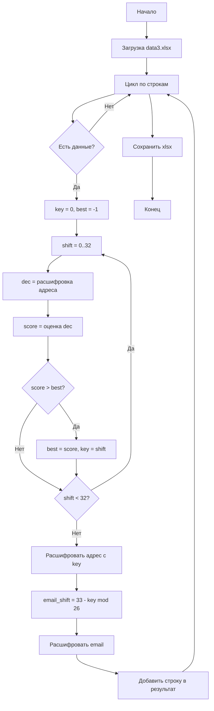

# Решение задачи 3. Деобезличивание данных

## Определение алгоритма

Анализ зашифрованных данных показал:

1. **Столбец «Телефон»** — 40 символов в hex, соответствует хешу SHA-1. Необратимое преобразование, деобезличивание невозможно.
2. **Столбец «email»** — латинские буквы, структура name@domain.tld сохранена. При переборе сдвигов 0–25 для латиницы получились читаемые адреса с доменами .com, .ru, .biz.
3. **Столбец «Адрес»** — кириллица, есть типичные сокращения (ул., д., кв.). При переборе сдвигов 0–32 для алфавита из 33 букв получаются осмысленные адреса.

**Вывод:** использован шифр Цезаря с индивидуальным ключом (сдвигом) для каждой строки.

Для кириллицы: сдвиг по алфавиту из 33 букв (а–я, ё).

Для латиницы: эквивалентный сдвиг по 26 буквам. Связь: `key_lat = (33 - key_cyr) % 26`.

## Описание решения

1. Чтение исходного Excel-файла.
2. Для каждой строки с данными:
   - определение ключа по полю «Адрес»: перебор сдвигов 0–32, выбор сдвига с максимальной оценкой правдоподобности (наличие ул., д., кв., частота букв);
   - расшифровка адреса сдвигом по кириллице;
   - расчёт сдвига для email: `(33 - key) % 26`;
   - расшифровка email сдвигом по латинице.
3. Запись результата в Excel с добавлением столбца «Ключ».

## Блок-схема



## Использование

```
python deobfuscate.py
```

Входной файл: `data3.xlsx`
Выходной файл: `data3_deobfuscated.xlsx`
